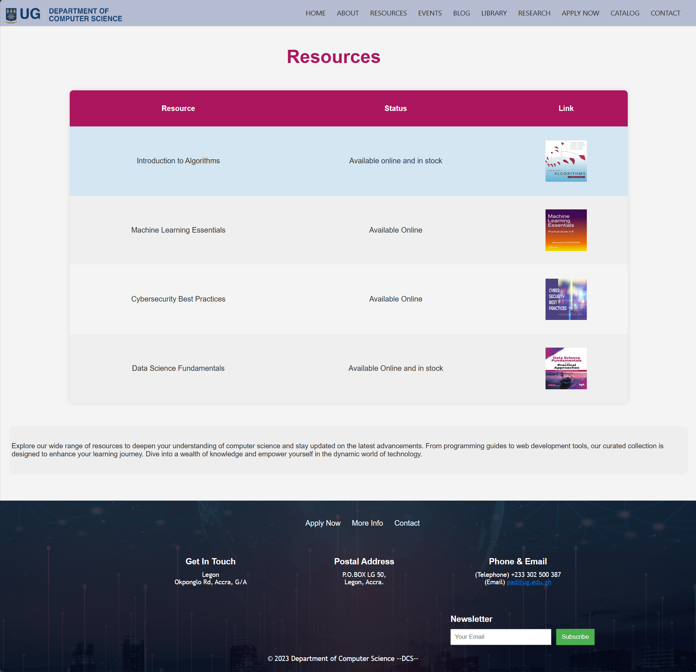
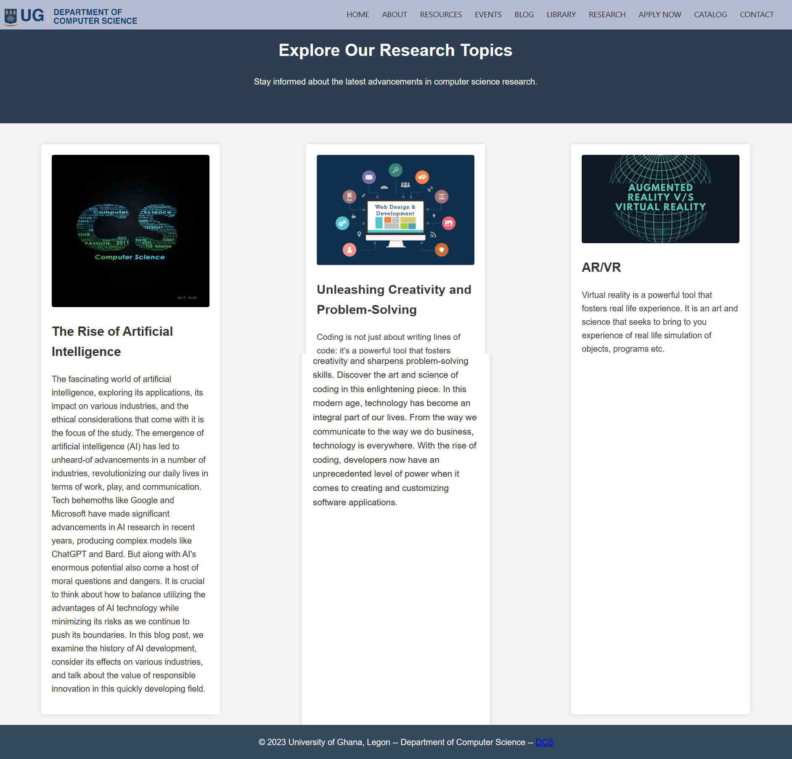
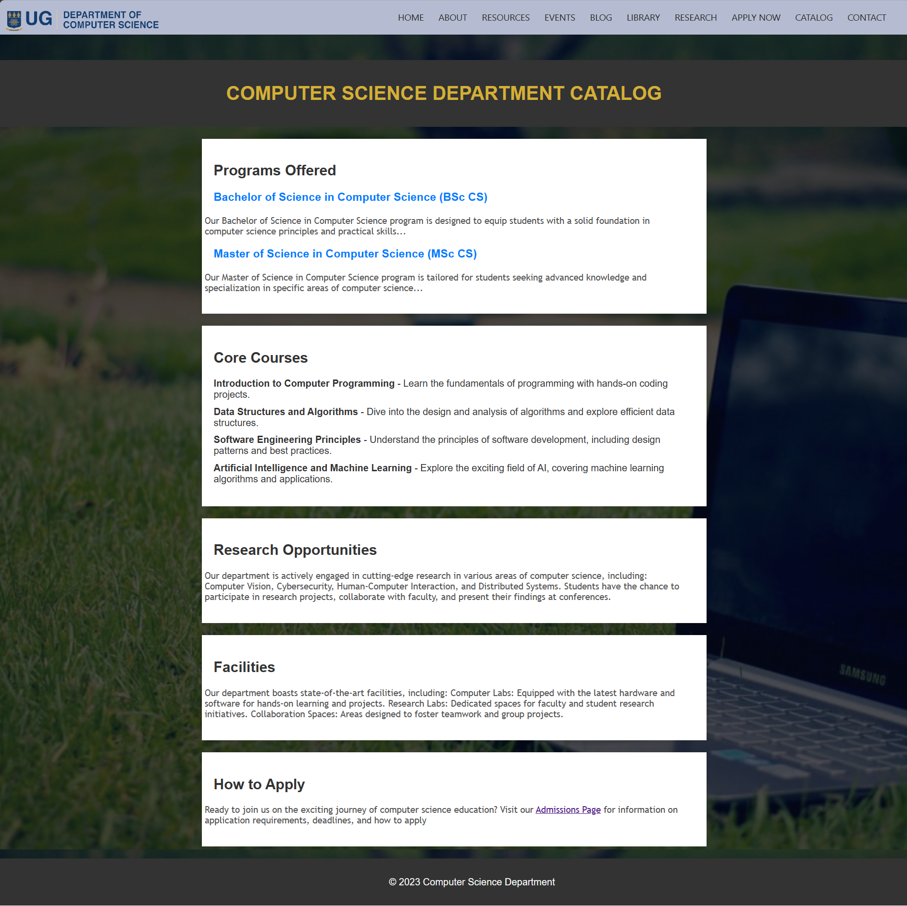
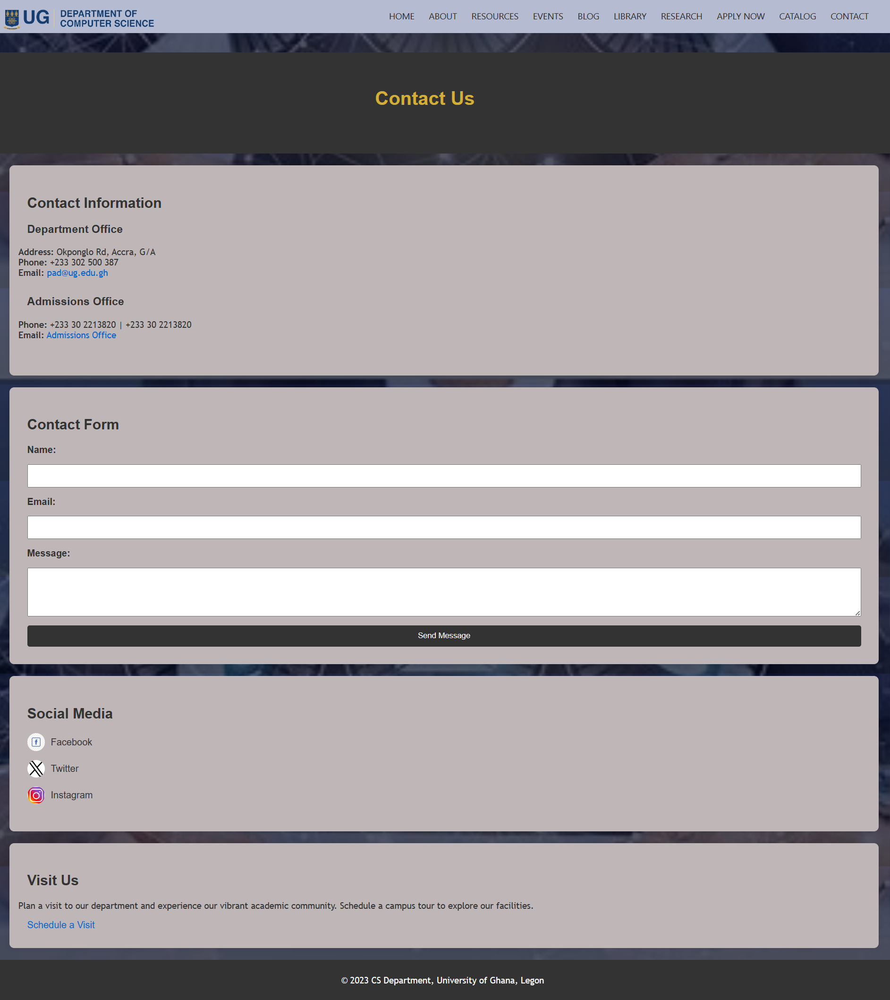

# WEBSITE FOR COMPUTER SCIENCE DEPARTMENT
This website is a personal rendition of University of Ghana's Computer Science Department website. Explore a range of pages offering information on upcoming events, resources, courses, a blog, and more. Immerse yourself in the world of computer science, stay informed about departmental activities, and engage with a wealth of educational content.

### Table of Contents
+ Cloning and Setting Up the Project
+ Creator
+ Screenshots
+ What I've Learned
+ Cloning and Setting Up the Project
+ To clone the project, follow these steps:

Open your terminal or command prompt and run the following command:

+ git clone https://github.com/username/project.git

+ Once the project is cloned, navigate to the project directory:
  cd project

## Creator
Name: Precious Amenuveve Tsewoo
Student ID: 11020486

## Screenshots
Please find below the screenshots of each page of the website:

Screenshot of home page

Screenshot of about page

Screenshot of resources page

Screenshot of events page

Screenshot of blog page

Screenshot of library page

Screenshot of research page 

Screenshot of applynow page

Screenshot of catalog page

Screenshot of contact page

## What I've Learned
This project has taught me various important skills, such as:
+ manipulation of html, css and javascript elements to represent my ideas
+ how to work with github for tracking changes and monitoring versions of code
+ Proper organization and structuring of a Readme document
+ Using Markdown syntax to format text and lists
+ Writing clear and concise instructions
